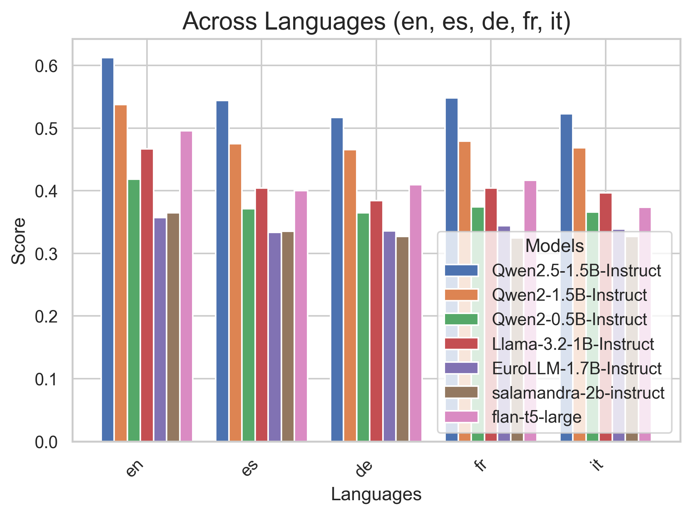
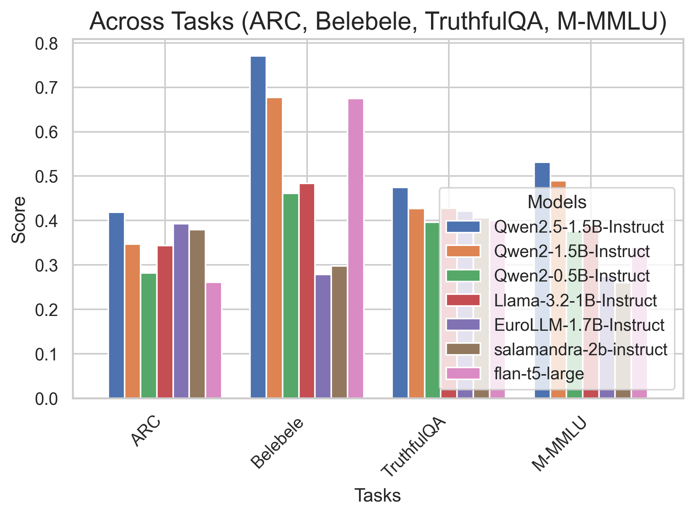
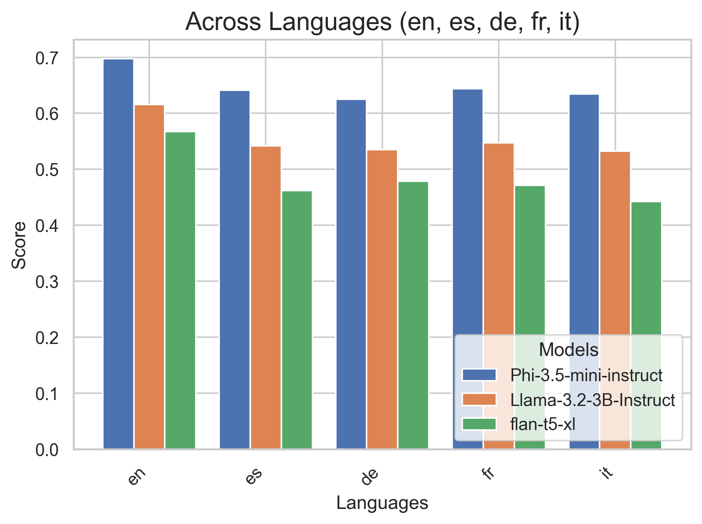
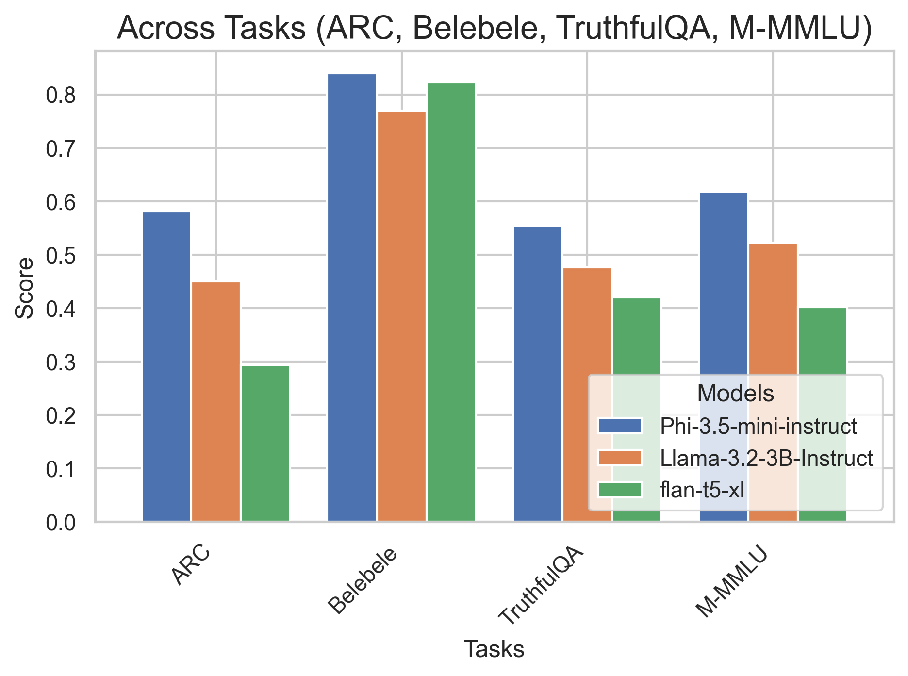
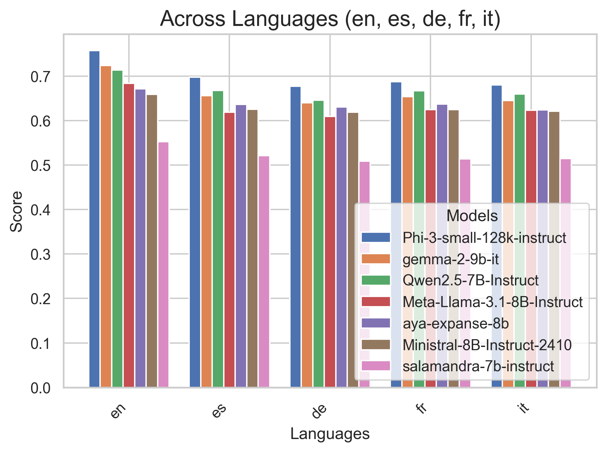
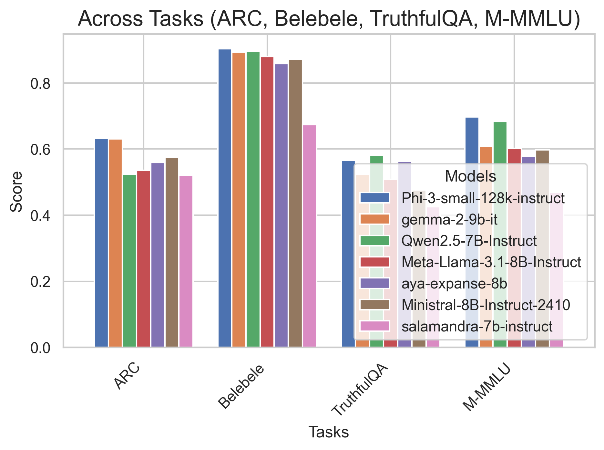
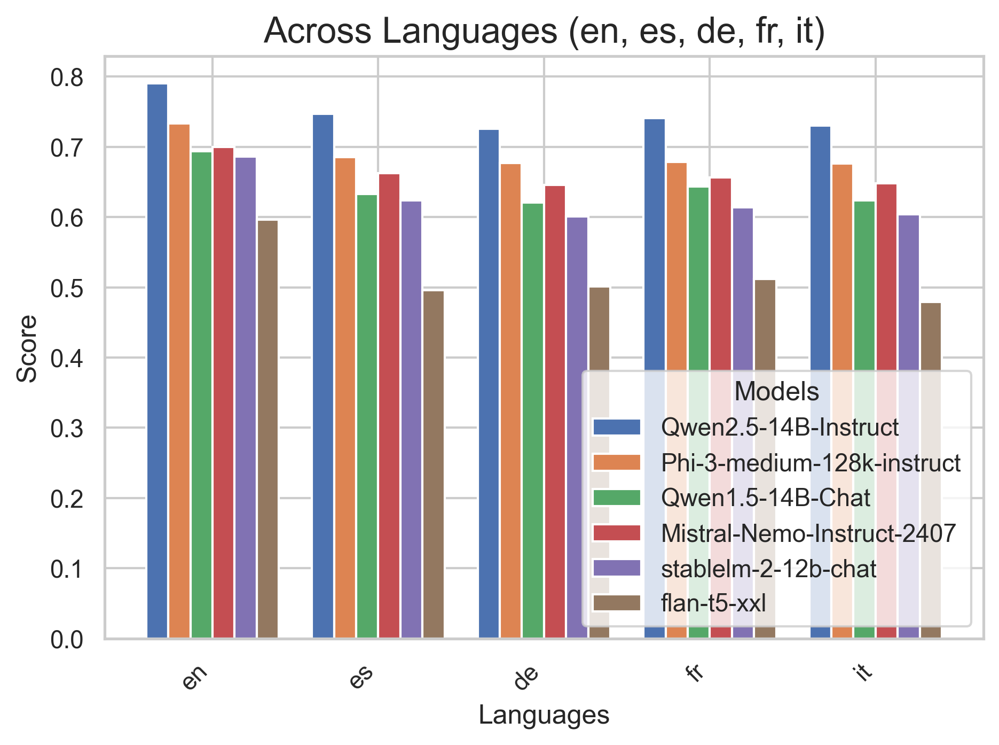
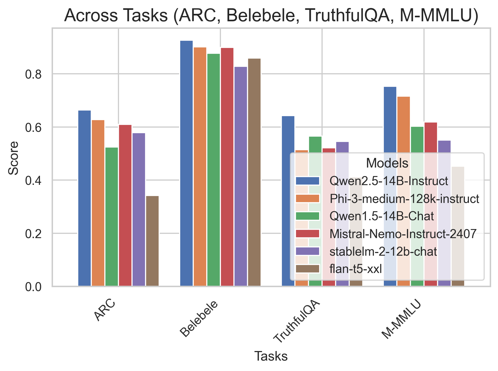
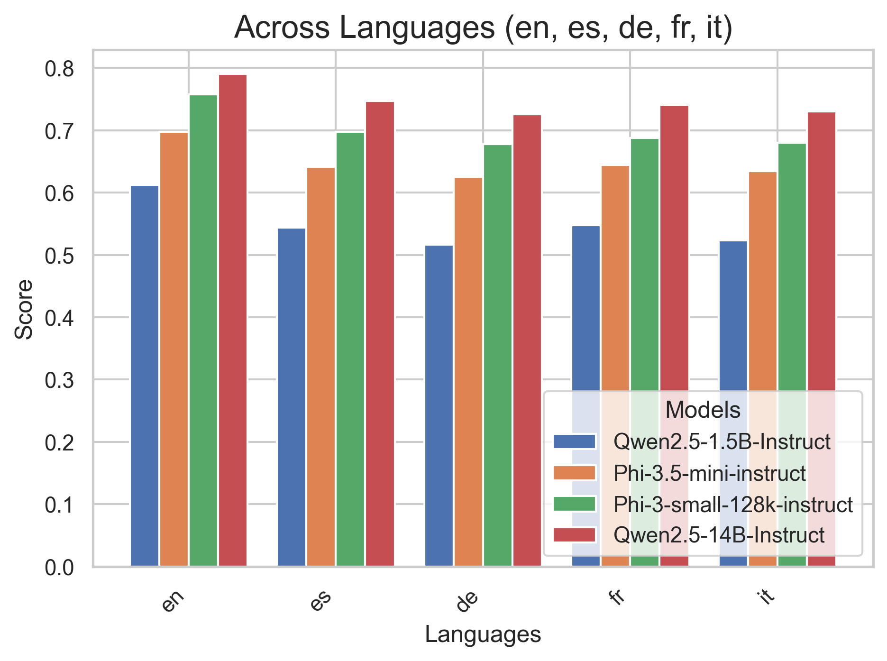
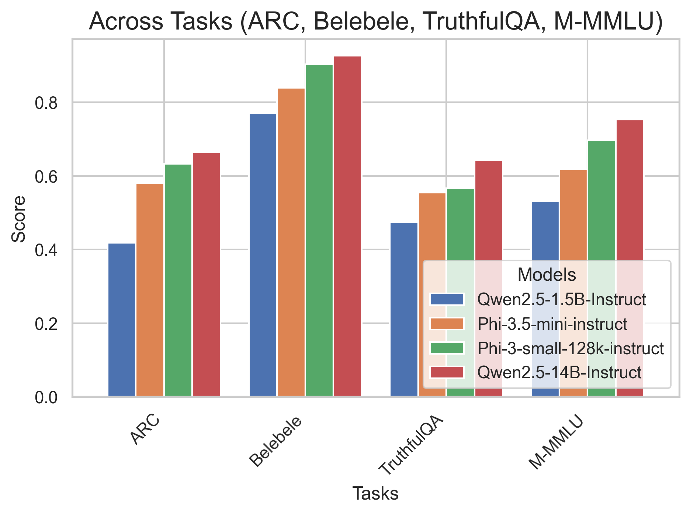

# Multilingual-LLM-Evaluation

Repo for evaluating multilingual LLMs using
Eleuther's [lm-evaluation-harness](https://github.com/EleutherAI/lm-evaluation-harness).

## Motivation

For a long time, open LLMs were trained on predominantly English corpora. It is great to see that many recent models
have seen more multilingual data during pretraining, such as Aya-Expanse, Qwen-2, Phi-3, or Llama-3.1. While these
models are comprehensively evaluated on English benchmarks, we often don’t know much about their multilingual
capabilities and comparable benchmarks are lacking.

## Setup

Set up the environment with: `./install_llm_eval.sh`

Run the evaluation with: `./run_llm_eval.sh`

Aggregate the outputs into a csv with: `python analyze_outputs.py`

Visualize the results with: `python visualize_results.py`

## Results

### < 2B Parameters

Qwen2.5-1.5B clearly outperforms all other models on all tasks and languages. Interestingly, salamandra-2b and
EuroLLM-1.7B that have specifically been optimized for multilinguality underperform clearly, especially on Belebele.
Surprisingly, flan-t5-large, a model released over two years ago, performs on par with Llama-3.2-1B despite only
having ~700M parameters.

### 3-4B Parameters

There is a clear progression from flan-t5-xl to Llama-3.2-3B to Phi-3.5-mini with the microsoft model taking the top
spot on all languages and tasks.

### 7-9B Parameters

Phi-3-small takes the top spot, with gemma-2-9b and Qwen2.5-7B coming in second. Unfortunately, salamandra-7b
underperforms clearly on all tasks and languages, despite its highly multilingual training.

### 11-14B Parameters

Qwen2.5-14B performs very strongly on all languages and tasks with Phi-3-medium coming in second. Qwen2.5 sees quite
sizable improvements compared to its predecessor Qwen1.5-14B.

### Conclusion

Overall, Qwen and Phi models perform best across sizes.

